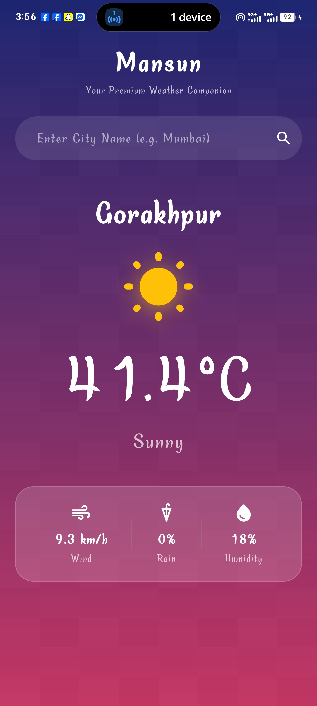

# Mansun - Premium Weather Companion

Mansun is a production-ready, clean-architecture weather application built using Flutter. It delivers real-time weather information, including dynamic humidity tracking and hourly precipitation probability, wrapped in a premium user interface.

## 🚀 Features
- **Real-Time Weather Data:** Fetches accurate, live data using the Open-Meteo API.
- **Dynamic Assets:** Automatically shifts icons and visual elements based on the current weather condition (Sunny, Rainy, Cloudy, etc.).
- **Hourly Rain Prediction:** Tracks the precise chance of rain for the current hour.
- **Persistence (Local Storage):** Saves the last searched city securely using `shared_preferences` so it reloads instantly when the app opens.
- **Premium User Experience:** Features a custom animated Splash Screen and a glassmorphic gradient user interface.

## 🛠️ Tech Stack & Architecture
- **State Management:** Flutter BLoC (Business Logic Component) for clean separation of UI and logic.
- **Network Client:** Dio for optimized and efficient API requests.
- **Architecture:** Clean Data-Repository Layer pattern ensuring high scalability and testability.
- **Local Storage:** SharedPreferences for persistent data caching.

## 📸 Screenshots
<p align="center">
  
</p>

## ⚙️ Setup & Installation
1. Clone this repository:
   ```bash
   git clone [https://github.com/Rohan592708/mansun.git](https://github.com/Rohan592708/mansun.git)